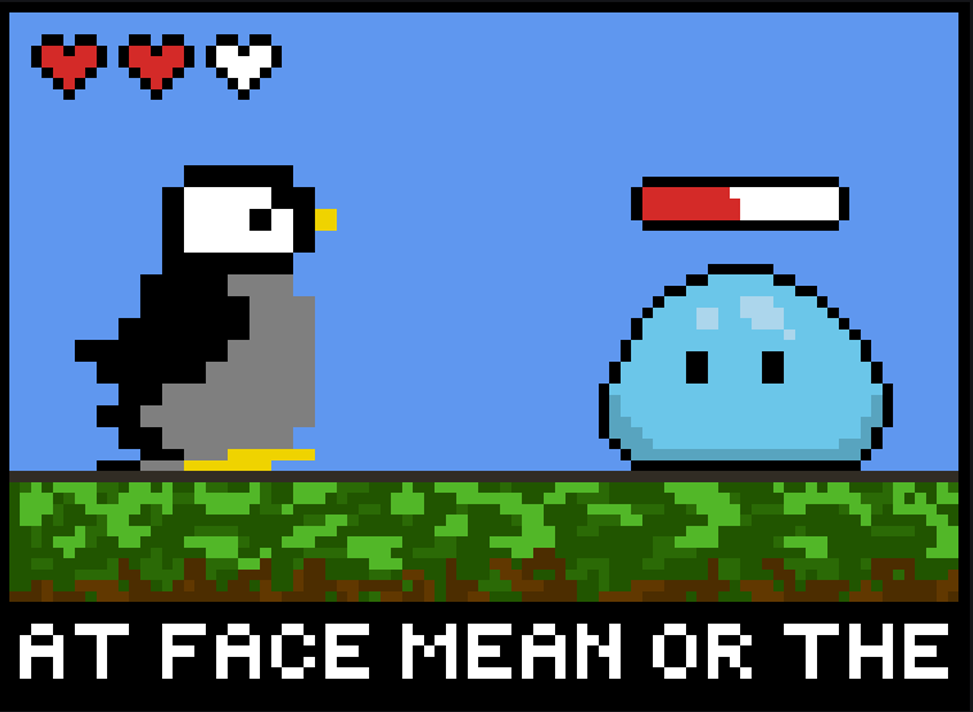

# RPG Type Hero
This application can be played on desktop/laptop devices. The game will be a 2D topdown RPG in which the user can control a player to walk around the map and interact with enemies. The user will be introduced with easier enemies where they are allowed to make mistakes and learn the mechanics of the game. As they progress by encountering more enemies, the difficulty will increase health wise. A GUI interface would be created for the user to interact with, and it would progress in a side scroller style.

# Product Vision
For people who are fans of video games and people who would like to practice their typing skills, RPG Type Hero is a 2D topdown typing RPG video game that increases the player’s competency on how well they type while enjoying classic RPG elements within the gameplay to provide entertainment and enjoyment to the player. Unlike many other video games out there, our product educates and entertains at the same time. The typing skills gained from playing this game can be very beneficial to use in the real world as well.

# User Personas

**Kareem, an elementary school student who has never played a video game before**

Kareem, age six, is a grade school student that attends a large primary school (elementary school) in the UK with over 1500 students. He’s born and raised in the UK and his parents, his father being a barber and his mother working in a daycare, are both trying their best to provide for their son and climb their way to the middle class. The father and mother are both from Iran and moved to the UK to find better and more opportunities for not just themselves but for their future kids as well.

Kareem’s student life has been exceptional. He has been getting A’s in most of his classes ever since he started his school life in primary school. Even though his parents are trying their best to sustain themselves financially, they felt like it was in their best interest to reward Kareem for the astounding effort he's putting into his studies. His parents decided to buy him a video game console along with some games to play and Kareem was ecstatic since he had heard his friends talk about video games a bunch before. This will be Kareem’s first introduction to the video gaming world & industry.

**Emily, a college student who feels bored after school**

Emily, a college student who feels bored when she has free time. She has to study a lot at school. Moreover, she has a bunch of homework to do and assignments to complete. She wants to improve her typing skills but she doesn’t want to try out keyboard practice software because they are all a bit tedious to interact with after a little while. She feels like she has to study but she wants to keep her mind off of that because she already studied a lot for all of her assignments and homeworks. She needs something to relax and also improve her typing skills.

**Tiffany, a secretary who wants to practice specific words**

Tiffany has been working as a secretary for a corporation for five years. She has basic office skills that satisfy her position such as word, excel, and PowerPoint. She became competent with her typing skills since high school that helped her career become much more successful.  She uses the word application everyday to continue to hone and train her skills to type more accurately and fast. However, after moving to another field, she faced a challenge. The field that Tiffany is working on is totally new for her. She has to learn more specialization words which negatively affects her performance. She cannot type as fast as before. Although working on these words everyday, she can not improve her skills anymore.

Tiffany decided to train her typing skill one more time. This time she has to find a technique that does not take many times to complete. She decided to use her leisure time to train her typing skill. Her brother, who loves to type, suggested that she plays RPG Type Hero. This game helps her relax and learn at the same time. 

**Dameon, a middle schooler learning to type for school**

Dameon, a seventh grade middle schooler, is taking a typing class at school. He is struggling in class to keep up and finds the take home practice he has been given to be boring so he hasn't been practicing. Because of this his parents were looking for an alternative practice method so he could improve his grades in class, the alternative has to be both exciting and educational which is where RPG Type Hero comes in. Dameon is given the game as a gift and is excited to play the new rpg. Dameon might lose interest if he realized it was an educational game. Dameon loves RPGs he played before and grew up playing games such as Paper Mario. 

**Brian, a high school student who is experienced with games**

Brian has been playing games his whole life. He started out with consoles like the PS3 and Xbox 360 and has since moved on to gaming on his personal computer. He knows exactly the types of games he likes to play and the way he plays them. He’s built his own computer to suit his specific needs. He has spent a lot of time on his computer and as a result, his typing skill is unorthodox compared to how most people learn to type. However, his experience typing allows him to type extremely fast and accurately. Brian is super into indie games and so he scours the internet to look for games that suit his specific tastes. While browsing, he discovers a new game with a unique mechanic that he hasn’t seen before. Interested, he takes a look at the reviews and decides to give it a try.

# User Features

- Implemented an in-game settings option
- Implemented graphical options within settings
- Implemented resolution options within settings
- Added functional user interface for the game
- Added movement for the character
- Added functional monsters for character to encounter
- When character encountered monster, menu popped up with “attack, defend, items, run”
- Menu option “attack” functioned properly
- Menu option “run” functioned properly
- Added damage calculation for the game
- Added health depletion
- Added restart functionality
- Added inventory to store items

# How to run
- Go to the latest release
- Download the Typing.rpg.binary.zip
- Extract the contents inside
- Run the TypingRPG.exe application

# How to contribute
Follow this project board to know the latest status of the project: [https://github.com/orgs/cis3296f22/projects/99]([https://github.com/orgs/cis3296f22/projects/99])  
- Download the latest version of Unity and Unity hub
- Clone this repo on your local repo
- Open that repo folder in unity
- You can now change things and commit/push those changes into a new branch!

### How to build
- Download the latest version of Unity and Unity Hub
- Use the current github repository
- Clone the repository into your local machine
- Open the project in Unity Hub
- Click on the sample scene
- Run the build at the top
